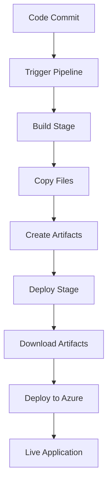

# 🚀 Azure DevOps Deployment Guide for Elite Realty

## 📋 Prerequisites

1. **Azure Subscription** - Active Azure subscription
2. **Azure DevOps Account** - Organization and project setup
3. **Azure App Service** - Web app resource created
4. **Git Repository** - Source code in Azure Repos or GitHub

## 🏗️ Step-by-Step Deployment

### 1. Create Azure Resources

#### Option A: Azure App Service (Recommended)
```bash
# Create Resource Group
az group create --name "elite-realty-rg" --location "East US"

# Create App Service Plan
az appservice plan create --name "elite-realty-plan" --resource-group "elite-realty-rg" --sku FREE

# Create Web App
az webapp create --resource-group "elite-realty-rg" --plan "elite-realty-plan" --name "elite-realty-app" --runtime "NODE|18-lts"
```

#### Option B: Azure Static Web Apps (Alternative)
```bash
# Create Static Web App
az staticwebapp create --name "elite-realty-static" --resource-group "elite-realty-rg" --source "https://github.com/yourusername/elite-realty" --location "Central US" --branch "main" --app-location "/" --output-location "/"
```

### 2. Set Up Azure DevOps Pipeline

#### A. Create Service Connection
1. Go to **Azure DevOps** → **Project Settings** → **Service Connections**
2. Click **New Service Connection** → **Azure Resource Manager**
3. Choose **Service Principal (automatic)**
4. Select your **Subscription** and **Resource Group**
5. Name it: `Azure-Service-Connection`

#### B. Configure Pipeline Variables
1. Go to **Pipelines** → **Library** → **Variable Groups**
2. Create new group: `elite-realty-variables`
3. Add variables:
   ```
   webAppName: elite-realty-app
   resourceGroupName: elite-realty-rg
   azureSubscription: Azure-Service-Connection
   ```

#### C. Create Pipeline
1. Go to **Pipelines** → **New Pipeline**
2. Select your repository (Azure Repos Git or GitHub)
3. Choose **Existing Azure Pipelines YAML file**
4. Select `/azure-pipelines.yml`
5. Click **Run**

### 3. Configure Repository

#### Update Pipeline YAML
Edit `azure-pipelines.yml` with your specific values:
```yaml
variables:
  webAppName: 'your-app-name-here'  # Change this
  resourceGroupName: 'your-resource-group'  # Change this
```

#### Repository Structure
Ensure your repository has:
```
elite-realty/
├── azure-pipelines.yml     # Pipeline configuration
├── web.config              # IIS configuration
├── index.html              # Main entry point
├── START-HERE.html         # Landing page
├── *.html                  # All HTML files
├── *.css                   # Stylesheets
├── *.js                    # JavaScript files
└── README.md               # Documentation
```

### 4. Deployment Options

#### Option 1: Azure App Service (Windows)
- **Pros**: Full IIS features, custom domains, SSL certificates
- **Cons**: Higher cost, more complex
- **Best For**: Production applications

#### Option 2: Azure Static Web Apps
- **Pros**: Free tier, global CDN, easy setup
- **Cons**: Limited server-side functionality
- **Best For**: Static sites, development

#### Option 3: Azure Storage Static Website
- **Pros**: Very low cost, simple
- **Cons**: No custom domains on free tier
- **Best For**: Development/testing

## 🔧 Configuration Details

### Environment Variables (Optional)
If you need environment-specific settings:
```yaml
# In azure-pipelines.yml
- task: FileTransform@1
  inputs:
    folderPath: '$(Build.ArtifactStagingDirectory)'
    fileType: 'json'
    targetFiles: 'config.json'
```

### Custom Domain Setup
1. Go to **Azure Portal** → **App Service** → **Custom Domains**
2. Add your domain
3. Configure DNS records
4. Add SSL certificate

### Performance Optimization
- Enable **Application Insights** for monitoring
- Configure **CDN** for static assets
- Enable **Compression** in web.config

## 🚦 Pipeline Workflow



## 🔍 Troubleshooting

### Common Issues

#### 1. Pipeline Fails at Deploy
```bash
# Check service connection permissions
az role assignment list --assignee <service-principal-id>
```

#### 2. Web App Shows Error
- Check **Application Logs** in Azure Portal
- Verify `web.config` is deployed
- Check file permissions

#### 3. Authentication Issues
- Verify service principal has **Contributor** role
- Check Azure subscription is active
- Regenerate service connection if needed

### Debug Commands
```bash
# Check deployment status
az webapp deployment list --resource-group "elite-realty-rg" --name "elite-realty-app"

# View application logs
az webapp log tail --resource-group "elite-realty-rg" --name "elite-realty-app"

# Test connectivity
curl -I https://elite-realty-app.azurewebsites.net
```

## 📊 Monitoring & Maintenance

### Application Insights Setup
```bash
# Create Application Insights
az monitor app-insights component create --app "elite-realty-insights" --location "East US" --resource-group "elite-realty-rg"
```

### Automated Backups
- Configure **Backup** in App Service
- Set retention policy
- Test restore procedures

### Performance Monitoring
- Set up **Alerts** for downtime
- Monitor **Response Times**
- Track **Error Rates**

## 🎯 Best Practices

1. **Use Staging Slots** for testing deployments
2. **Enable Health Checks** for reliability
3. **Implement Blue-Green Deployments** for zero downtime
4. **Use ARM Templates** for infrastructure as code
5. **Secure Secrets** with Azure Key Vault

## 📞 Support Resources

- [Azure DevOps Documentation](https://docs.microsoft.com/en-us/azure/devops/)
- [Azure App Service Documentation](https://docs.microsoft.com/en-us/azure/app-service/)
- [Azure Static Web Apps Documentation](https://docs.microsoft.com/en-us/azure/static-web-apps/)

---

## 🚀 Quick Start Commands

```bash
# Clone repository
git clone <your-repo-url>
cd elite-realty

# Create Azure resources
az group create --name "elite-realty-rg" --location "East US"
az webapp create --resource-group "elite-realty-rg" --plan "elite-realty-plan" --name "elite-realty-app"

# Push to trigger deployment
git add .
git commit -m "Initial deployment"
git push origin main
```

Your Elite Realty application will be live at: `https://elite-realty-app.azurewebsites.net` 🎉 